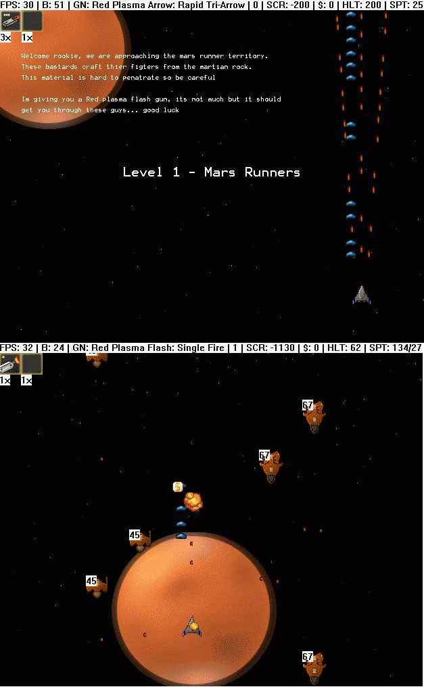



## Advanced Space Shooter

### Description

over 2200 lines! Advanced engine supports level scripting, no limit on enemies, guns,

explosions, objects, helpers. Very customizable. Includes my first level, mars. Please

use this code for something because I may not be able to continue it. the basic engine is

complete, just add graphics, levels, and personality!

note: I have the original, full color bitmaps if you want them email me:

bphil88@adelphia.net

or if you want more detail on script existing commands
 
### More Info
 

             |
---                |---
**Submitted On**   |2002-04-16 08:37:56
**By**             |[N/A](https://github.com/Planet-Source-Code/PSCIndex/blob/master/ByAuthor/empty.md)
**Level**          |Advanced
**User Rating**    |3.8 (15 globes from 4 users)
**Compatibility**  |VB 5\.0, VB 6\.0
**Category**       |[Games](https://github.com/Planet-Source-Code/PSCIndex/blob/master/ByCategory/games__1-38.md)
**World**          |[Visual Basic](https://github.com/Planet-Source-Code/PSCIndex/blob/master/ByWorld/visual-basic.md)
**Archive File**   |[Advanced\_S1652481012003\.zip](https://github.com/Planet-Source-Code/advanced-space-shooter__1-48929/archive/master.zip)

